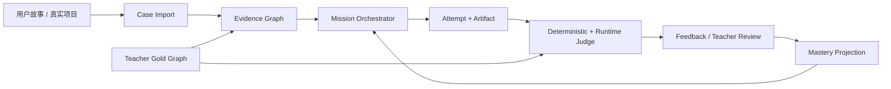

# LearnWithAI 2.0：可执行业务决策训练场

> 这是一份面向下一代产品的架构设计文档。它参考当前仓库的代码图谱、业务图谱、设计评审和前端原型，但不继承旧文档的阶段划分、四关题型或时间安排。
>
> 本文中的“已存在”只指能在当前仓库找到实现的能力；“规划”表示需要按本文实现，不能在答辩材料中写成已完成。

## 0. 先给结论

我们要做的不是代码讲解器，也不是让 AI 给学生的模块图打一个分数，而是一个**可执行业务决策训练场**：

```text
模糊需求
  → 证据澄清
  → 领域与边界
  → 状态、规则、权限
  → 方案权衡
  → 最小可运行切片
  → 场景回放与故障注入
  → 需求变更与影响分析
  → 陌生领域迁移
```

学生的每一步都产生有版本号的产物。系统不只问“答对了吗”，还检查：

- 设计是否能编译成状态机、规则表、接口契约或测试；
- 设计是否能在真实代码或最小运行时中执行；
- 异常、并发、重复请求、权限和故障是否被考虑；
- 需求改变后，学生能否定位受影响的规则、数据、接口、测试和迁移步骤；
- 同一套方法能否迁移到没有见过的新业务。

一句产品定位：**把业务逻辑从“看懂模块”变成“在约束下做出可运行、可解释、可变更的决策”。**

## 1. 为什么要重新定义“业务逻辑”

学生会画流程图，不等于会做业务设计；能复述函数，也不等于能交付系统。业务逻辑真正困难的地方在于：目标不完整、规则会变化、多个角色有不同权限、对象会经历状态变化、并发与失败会破坏直觉、设计还必须落到代码和测试。

因此，本项目把业务逻辑能力定义为：

> 在约束不完整、规则会变、存在异常和并发的条件下，把业务目标转化为可追溯的决策模型；把模型实现为可运行系统；运行失败后能定位违反的规则、状态或边界并进行有证据的修订；最后在陌生领域复用同一过程。

平台只认可可观察证据，不把“看过讲解”当作能力证据。每个完整任务至少包含：

1. `Context`：目标、参与者、成功指标、约束和未知问题；
2. `Evidence`：事实、假设、来源、置信度和待确认问题；
3. `Domain`：实体、属性、事件、关系和边界；
4. `State`：生命周期、合法转移、非法转移和补偿动作；
5. `Rule`：前置条件、后置条件、不变量、冲突优先级和权限；
6. `Tradeoff`：至少两个方案、选择依据、放弃理由和风险；
7. `Vertical Slice`：一条从入口到持久化/反馈的最小可运行路径；
8. `Replay`：预测、实际结果、日志、测试和差异定位；
9. `Change/Transfer`：需求变更影响、迁移方案和陌生案例重做。

### 1.1 三个概念必须分开

| 概念 | 说明 | 平台展示 |
|---|---|---|
| 作品质量 | 当前案例的结构化产物是否完整、可执行、可追溯 | 本次 rubric 得分与缺口 |
| 行为可靠性 | 在反例、并发、重复请求、失败恢复中的运行表现 | 场景通过率、关键不变量、回放差异 |
| 迁移能力 | 在新案例和延迟测验中能否复用方法 | 盲评迁移分、变更后保持率、解释质量 |

一次高分提交只能证明作品质量较好，不能直接证明“平台培养有效”。只有在保留案例、陌生案例和延迟测验中都满足预注册的评测条件，才报告为能力迹象。

### 1.2 八维能力量表

每个维度采用 0–4 级行为锚点。任务可以按难度启用其中一部分，但不能只用选择题代替。

| 维度 | 0 级 | 2 级 | 4 级 |
|---|---|---|---|
| 问题框定 | 复述题干 | 写出目标和主要角色 | 指标、约束、未知项和成功/失败边界可追溯 |
| 证据与假设 | 无来源断言 | 区分部分事实与假设 | 每条关键决定有来源、置信度和待确认问题 |
| 领域边界 | 所有功能塞进一个模块 | 能列实体和模块 | 能解释所有权、边界、依赖和不应合并的职责 |
| 状态与流程 | 只有主流程 | 有状态和常见异常 | 合法/非法转移、补偿、幂等和并发行为可执行 |
| 规则与权限 | 只写“管理员可操作” | 有几条条件判断 | 不变量、优先级、资源归属、时效和冲突策略完整 |
| 方案权衡 | 只有一个方案 | 能比较两个方案 | 用约束、成本、风险、可靠性、可演进性解释取舍 |
| 工程映射 | 只有概念图 | 能映射接口或表 | 设计、代码、测试、日志和失败恢复相互可跳转 |
| 验证、变更与迁移 | 只说“测试通过” | 有主路径测试 | 能预测回放差异，定位根因，完成变更并迁移到新领域 |

默认通过条件是：硬约束全部满足，关键不变量有测试或回放证据，软指标达到任务配置的阈值；低置信度和争议结果进入教师复核，不自动包装成确定结论。

## 2. 训练流程：八步能力闭环

平台把原来的“看图—答题”改成八步工作台。每步提交一个不可变版本，学生可以继续修订，但历史版本不能覆盖。

### Step 1 — Observe：观察真实场景

学生只摘录模糊 brief、用户访谈片段、制度条款、日志、接口样例或测试失败记录，不急着下结论。系统要求保留原文片段、观察时间、来源和“不知道什么”。此时禁止直接画模块。

### Step 2 — Frame：建立证据包

学生把材料标记为“事实 / 假设 / 待确认”，形成目标、参与者、成功指标、约束和风险；每个关键决定绑定证据来源，再写出“如果答案是 A/B，会改变哪个设计”。平台随机抽取一条证据要求学生解释其影响，防止照抄模板。

### Step 3 — Flow：建立领域、流程和状态

学生创建 Actor、Entity、Event、State、Transition 和边界。系统能把状态机编译成可执行检查：非法转移、重复事件、过期事件、并发冲突和补偿路径。

### Step 4 — Rule：写规则、权限和不变量

规则以结构化表提交：`when`、`precondition`、`decision`、`postcondition`、`priority`、`actor`、`resource_scope`、`failure_action`。权限同时考虑角色、资源归属、时效和状态，不能只填一个角色枚举。

### Step 5 — Design：提出并权衡方案

学生至少提交两个模块/数据流方案，用任务给出的约束权重比较可靠性、成本、可解释性、延迟、迁移难度等指标，并写出放弃理由。教师可以维护“可接受替代结构”，平台不把一种命名方式误判为唯一正确答案。

### Step 6 — Build：实现垂直切片

学生从关键路径实现最小 CLI 或 Web API，提交接口契约、数据结构、代码、测试和日志配置。先完成一条薄切片，再扩展边界；代码必须能在沙箱中运行，依赖和命令写入构建清单。

### Step 7 — Operate：预测、运行、回放

学生先预测每个场景的状态、返回值、事件和不变量，再运行主路径、反例、重复请求、并发、超时、依赖不可用等场景。系统保留实际 trace，展示“预测—实际—违反的规则—最小修订”。

### Step 8 — Change / Transfer：改需求并迁移

系统注入政策、角色、库存、资源或时限变化。学生提交影响集合、数据迁移、兼容策略、回归测试和风险说明，再把同一方法用于没有看过的领域。迁移任务不下发原案例 Gold Graph。

脚手架采用渐隐策略：示范 → 部分填空 → 诊断反例 → 独立生成 → 陌生迁移。反馈只揭示下一步行动，不直接给出完整答案。

## 3. 贯穿案例：校园设备借还

推荐用校园设备借还作为第一次现场演示，因为它同时包含资源竞争、状态、权限、幂等、并发和变更。

### 3.1 业务对象与关键规则

```text
实体：Item、User、Reservation、Loan、Maintenance、Fine
Item.operational_status：in_service | maintenance | lost | retired
Reservation.status：pending | confirmed | fulfilled | cancelled | expired
Loan.status：active | returned | lost_settled
overdue：由 due_at 与 returned_at 推导，不另造一个共享状态
available：由库存/占用查询计算，不作为所有实体的共同生命周期
规则：一人最多一笔活动借用；逾期冻结；教师可批准例外；
      维修/遗失影响分配；重复扫码幂等；最后一台设备并发竞争。
```

一次 `checkout` 事务必须同时处理 `Reservation → fulfilled`、`Loan → active` 和设备占用分配，全部成功或全部回滚。学生必须回答：预约是否占用容量、取消与过期如何释放资源、教师例外是否需要审计、扫码重试是否会产生两笔借用、设备损坏与部分归还如何结算。

### 3.2 反例库

- 没有声明预约是否占用容量，导致同一规则在排队和借出时自相矛盾；
- 只按角色放权，遗漏资源归属、预约时间窗和安全培训；
- 只检查当前库存，忽略队列和并发抢占；
- 没有幂等键，网络重试产生两笔借用；
- 没有损坏、遗失、部分归还和补偿状态；
- 管理员封闭设备后，未来预约仍然可以进入 `approved`。

### 3.3 第二案例：实验室预约

```text
实体：Room、Equipment、Slot、Booking、User、Approval、SafetyCert
状态：pending → approved → active → completed
      pending → rejected / cancelled；approved → no_show / emergency_closed
规则：重叠预约、审批时限、开场锁定、爽约冷却、安全证有效期、
      容量与设备组合；紧急封闭必须使未来预约失效并留下审计记录。
```

学习操作与设备借还相同：先标事实和未知，再画预约状态机，写申请人/负责人/管理员权限矩阵，预测冲突、证书过期、并发抢最后时段，回放后注入“临时封闭”做影响分析。

反例包括：只比较起止时间而不计算锁定窗口；审批后安全证过期仍可进场；只改房间状态而不取消未来 `Booking`；管理员绕过审计直接改结果。

国赛演示可以用三联屏：左侧学生设计，中间预测，右侧沙箱回放与证据链。随后注入“设备临时封闭”或“新增研究生例外”，展示影响分析、迁移和回归测试。

## 4. 产品架构

```text
┌──────────────────────────── LearnWithAI 2.0 ────────────────────────────┐
│ 学生工作台：Evidence → Model → Simulate → Build → Operate → Change     │
│ 教师工作台：Gold Graph / 反例库 / Rubric 锚例 / 任务变体 / 复核队列       │
│ 评审工作台：证据链回放 / 盲评 / 版本比较 / 导出国赛材料                   │
├─────────────────────────────────────────────────────────────────────────┤
│ Learning Orchestrator：任务 DSL、脚手架、能力画像、下一任务             │
│ Submission & Judge：结构校验、图约束、状态模拟、隐藏测试、语义信号       │
│ Case & Evidence：源码、测试、运行轨迹、业务图谱、教师 Golden Graph       │
│ Event Store：追加写入的学习事件、artifact 版本、评测版本、审计链         │
│ Sandbox Runner：受限代码执行、依赖、CPU/内存/时间/网络白名单              │
├─────────────────────────────────────────────────────────────────────────┤
│ SQLite + 本地 Blob（单机默认）│ PostgreSQL/对象存储（多人部署，可选）      │
└─────────────────────────────────────────────────────────────────────────┘
```

### 4.1 Case & Evidence Service

导入一个真实项目或教师编写的案例，创建不可变 `CaseSnapshot`。解析器可以来自 Python AST、调用图、测试、运行日志、Git diff 或教师录入。每条机器结论必须包含：

```json
{
  "claim_id": "claim:loan:state:borrowed",
  "kind": "state_transition",
  "value": "reserved -> borrowed",
  "evidence": [{"file": "loan_service.py", "start_line": 41, "end_line": 58}],
  "confidence": "verified",
  "extractor_version": "python-ast-0.1.0",
  "review_status": "machine_only"
}
```

学生只看到任务允许的 Evidence Pack，不看到完整 Gold Graph；教师可以确认、改名、拒绝或增加可接受替代结构。

### 4.2 Learning Orchestrator

课程不是写死在前端的页面，而是版本化任务 DSL。编排器根据任务目标、学生的错误标签、已用脚手架、迁移表现和教师策略选择下一项任务。固定顺序只用于第一次示范，自适应路线不能以“做了几题”替代能力信号。

### 4.3 Submission & Judge

判题分三层：

1. **确定性层**：JSON Schema、必填字段、图连通性、状态机可达性、规则冲突、引用存在性；
2. **运行层**：状态机回放、隐藏场景、属性测试、重复请求、并发、故障注入、变异测试；
3. **语义层**：可选 LLM 只输出结构化 `CriterionSignal`（级别、证据、置信度、缺口和建议），不能直接改最终分数，服务端规则聚合结果。学生模型生成的测试只能证明模型内部一致；正式通过还要依赖教师独立冻结的约束、人工核对场景和独立 oracle。AI 生成的反例也必须经教师审核后才进入正式评分。

每次评测记录 `judge_version`、`rubric_version`、`model_version`、provider 配置、prompt 哈希、输入哈希和场景哈希。锁定环境、输入、虚拟时钟和随机种子后，确定性规则可重算；LLM 只保存原始请求与响应以回放原评语，不能承诺再次调用得到相同文本。真实并发不追求日志逐字相同，而比较不变量和允许的结果集合。无模型时，确定性与运行层仍然可用。

### 4.4 Event Store 与回放

关键业务状态变化追加事件：`start_attempt`、`save_revision`、`request_evaluation`、`run_scenario`、`request_hint`、`review_decision`。`ArtifactRevision`、评测结果和教师决定保存为不可变版本；首版不强行做全量 event sourcing，而是在同一 SQLite 事务中写业务状态和审计事件，验证规模与恢复需求后再升级。事件至少含：`event_id`、聚合 ID、序号、操作者、时间、payload、schema 版本、前一事件哈希和当前哈希。写入命令必须带幂等键和 `aggregate_seq`，用乐观并发拒绝旧版本覆盖新版本；runner 崩溃时先写入 `run_started`，恢复后补 `run_finished` 或 `run_failed`，不能让评测结果只存在内存里。哈希链只能发现记录范围内的改动，不是本机管理员不可伪造的安全证明。

### 4.5 Sandbox Runner

首版没有虚拟化时只执行受限 DSL 和教师可信样例，不运行未知学生代码。任意 Python/CLI 提交必须进入一次性 VM、WSL2/Docker Desktop 或独立 Linux runner；Linux 可使用 rootless 容器，但仍需只读挂载、独立可销毁工作目录、默认无网络和最小权限。Windows Job Object 只做进程生命周期与资源限制，不能宣称安全隔离。生产部署应将 runner 与 API 分开，即使学生程序死循环也不能拖垮学习记录和教师工作台。

## 5. 最小数据模型

首版不强制 Neo4j，使用 SQLite 的关系表和边表即可；图数据库、PostgreSQL、向量检索都是可替换适配器。

```text
Workspace / User / Role
Case / CaseSnapshot / Evidence / Claim / BizNode / BizEdge
Mission / MissionVersion / Scenario / HiddenTest
Attempt / Artifact / ArtifactRevision / Event
EvaluationRun / CriterionSignal / FeedbackItem / Review
MasterySnapshot / ChangeRequest / TransferTask
```

最小契约示例：

```json
{
  "artifact_id": "art_01J...",
  "case_id": "case_device_loan_v1",
  "stage": "rule",
  "version": 3,
  "parent_id": "art_01H...",
  "payload": {
    "invariants": [{"id": "stock_nonnegative", "expression": "available >= 0"}],
    "rules": [{"when": "scan_item", "precondition": "loan.status != returned", "decision": "reject"}]
  },
  "evidence_links": ["claim:loan:state:borrowed"],
  "ai_trace": {"used": true, "hints": 2, "accepted_edits": 0},
  "payload_sha256": "...",
  "schema_version": "artifact-1.0"
}
```

任务 DSL 示例：

```yaml
mission_id: change_inventory_v2
objective: 在新增设备封闭政策后保持借还不变量
artifacts: [context, evidence, state_machine, rule_table, api_contract, tests, impact_report]
scenarios:
  - normal_checkout
  - duplicate_scan
  - concurrent_last_item
  - emergency_closure
hidden_tests: [stock_nonnegative, idempotency, closed_item_unavailable]
expected_invariants: [stock_nonnegative, approved_requires_valid_user]
fault_injection: [duplicate_scan, timeout_inventory_service, emergency_closure]
acceptable_alternatives: [reservation_separate_from_loan, reservation_as_capacity_hold]
transfer: multi_warehouse_inventory
feedback_policy: evidence_first
```

同一份 DSL 同时驱动学生视图、仿真器、判题器、反馈和研究日志，避免“题目一套定义、评分另一套定义”。

## 6. 反馈、AI 边界与作者性

反馈分为六级，逐级解锁：

- L0：字段、格式、语法缺失；
- L1：结构性线索，例如“有一个状态没有出口”；
- L2：因果追问，例如“什么事件能到达这个状态，前置条件是什么”；
- L3：反例轨迹和失败日志，要求学生定位；
- L4：匿名替代方案和取舍比较，要求学生重写；
- L5：提交后的教师/专家评语。

每条反馈必须带证据引用、影响维度和下一步动作。AI 可以提问、生成反例、检查一致性和解释日志；AI 不得下发完整 Gold Graph、代写提交、代替教师改分或在学生视图隐藏其使用记录。系统记录提示、模型、学生接受/拒绝的编辑和最终提交差异。关键任务可随机化案例、要求口头/文字辩护，以减少代答。

## 7. 本地电脑部署方案

### 7.1 首选单机形态

```text
Python 3.12 + FastAPI
SQLite WAL + 本地 Blob
Vue 3/Vite（沿用当前前端，逐步迁移为 Mission Runtime）
后台任务：asyncio；多人规模再换 RQ/Celery
LLM：可选 OpenAI-compatible API 或 Ollama
代码执行：受限 runner
```

学生源码默认不离开电脑。没有 LLM 时，任务结构校验、状态回放和隐藏测试仍可完成；联网模型只提供辅助语义信号，不是核心判题依赖。若使用外部模型，必须先脱敏并明确获得配置许可，记录模型、提示、输入哈希和返回版本；教师/管理员可以全局关闭外部调用。

最终桌面交付应提供 `learnwithai.exe` 或 Tauri 包：启动本地 API、随机选择可用端口、等待 `/api/health`、首次运行创建 SQLite/WAL 和 Blob 目录、导入 `.lwz`，并附离线依赖缓存与 `start.ps1` / `stop.ps1`。Docker Compose 是多人部署选项，不是单机用户的唯一入口。

### 7.2 Docker Compose 形态

多人部署时增加 `api`、`worker`、`web`、`postgres`、`runner`，对象存储可选 MinIO。部署包包含数据库迁移、案例快照、任务 DSL 和版本清单；所有案例都能导出为 `.lwz` 文件，支持脱敏、校验和签名。

### 7.3 目标目录

```text
apps/desktop/                 # Tauri，可选桌面打包
apps/web/                     # 学生/教师/评审工作台
services/api/                 # FastAPI、RBAC、契约接口
services/worker/              # 分析、评测、导出任务
packages/domain/              # 实体、事件、投影、策略
engine/indexer/               # AST、调用图、测试与运行证据插件
engine/graph/                 # 业务图、证据图、Gold Graph
engine/curriculum/            # Mission DSL、脚手架与路线
engine/judge/                 # 结构、运行、语义三层判题
engine/mastery/               # 作品/行为/迁移三个投影
engine/sandbox/               # runner 与资源限制
contracts/                    # JSON Schema/OpenAPI
infra/                        # compose、迁移、Ollama 配置
```

### 7.4 关键 API

```text
POST /api/v1/cases/import
GET  /api/v1/cases/{id}/graph
POST /api/v1/cases/{id}/publish
GET  /api/v1/paths/{id}/next
POST /api/v1/missions/{id}/attempts
PUT  /api/v1/attempts/{id}/artifacts
POST /api/v1/artifacts/{id}/validate
POST /api/v1/artifacts/{id}/compile
POST /api/v1/runs
GET  /api/v1/runs/{id}/trace
POST /api/v1/changes/impact
POST /api/v1/reviews/{id}/decision
POST /api/v1/bundles/export
```

前端只消费契约结果，不在浏览器复制判题算法；答案、隐藏测试和教师 Gold Graph 不下发给学生端。

数据流可以压缩成一条可回放链：



每一条箭头都落到事件表；事件、artifact、评测和教师决定可以按版本、哈希和因果 ID 回放。

## 8. 当前仓库如何迁移

当前仓库不是废弃物，而是新系统的第一批插件和样例。迁移边界如下：

| 当前路径 | 复用方式 | 新架构角色 |
|---|---|---|
| `engine/business_graph/` | 保留 `domains/capabilities/cards/scenarios` 的证据提取能力 | Case & Evidence Adapter |
| `engine/deep_analyzer/` | 保留 AST、调用、状态、流程等可定位证据 | Indexer 插件 |
| `engine/design/` | 把现有结构评审转换为 CriterionSignal，不作为唯一评分器 | Judge 规则插件 |
| `backend/app/main.py` | 保留 FastAPI 启动方式，拆成 cases/missions/attempts/runs/reviews 路由 | API 外壳 |
| `frontend/src/components/BusinessGraphView.vue` | 作为 Evidence Graph 视图 | 教师/学生证据面板 |
| `frontend/src/components/StageDesign.vue` | 拆成 Artifact 编辑器与版本比较 | Mission Runtime |
| `frontend/src/stores/learningSession.js` | 过渡期本地会话；最终由事件投影替换 | Attempt 状态 |
| `scripts/test_*.py`、`validation/` | 保留为回归与人工核对证据 | 验证资产 |

应当重写的部分：旧四关题型、固定六阶段导航、只提交文本的训练接口、前端重复评分、没有运行时的设计评审、把 `inferred` 结果直接当 Gold Graph、把一次分数叫“培养效果”。旧快照可以作为导入格式，不能成为新内核契约。

## 9. 从零到可演示的实现门槛

不按“第几天完成”排期，按可验收门槛推进。

### Gate A：最小闭环

- 单机 SQLite；
- 一个校园设备借还案例；
- 三个任务：`Map`、`Simulate`、`Change`；
- 结构化画布、artifact 版本、状态机回放、至少五个隐藏场景；
- 学生可以导出自己的证据链；
- 没有模型时仍能运行。

### Gate B：教师可控

- 教师编辑 Gold Graph、反例、可接受替代和 rubric 锚例；
- 低置信度图谱和争议评分进入复核队列；
- 教师修改可以产生新版本，不覆盖历史评测；
- 两个领域案例：设备借还、实验室预约。

### Gate C：工程可信

- 代码沙箱、重复请求、并发、故障恢复和资源限制可演示；
- 同一输入、版本和场景能得到相同确定性结果；
- 导出包可在另一台电脑导入并回放；
- 所有对外数字都能回指样本、任务版本、评分者和脚本。

### Gate D：研究与国赛材料

- 预注册研究协议、评分锚例、盲评流程和分析脚本；
- 课程前测、平台后测、陌生案例和 2–4 周延迟测验；
- 实验组与主动对照组，按班级或学生随机分组；
- 双评者盲评，报告 ICC 或加权 κ、效应量、95% CI、缺失和 AI 使用；
- 软件、实物/模型化演示、技术报告、用户手册、数据字典和复现实验包齐全。

## 10. 挑战杯国奖路线：证明什么，而不是喊什么

“国奖”不是技术架构自动带来的结果，必须同时满足当届赛道、作品形式、学生作者和材料要求。下面的 2025 年官方通知与规则只是往届示例，链接和评审口径可能变化；报名与提交前必须用当届官网公告替换。往届通知中，科技发明制作强调应用价值和转化前景；赛事也强调科技创新、实践和成果交流：[第十九届赛事通知](https://2025.tiaozhanbei.net/d49/article/676/)、[竞赛评审规则 PDF](https://2025.tiaozhanbei.net/media/ckeditor_uploads/49/2025/06/13/2.%E2%80%9C%E6%8C%91%E6%88%98%E6%9D%AF%E2%80%9D%E5%85%A8%E5%9B%BD%E5%A4%A7%E5%AD%A6%E7%94%9F%E8%AF%BE%E5%A4%96%E5%AD%A6%E7%A7%91%E6%8A%80%E4%BD%9C%E5%93%81%E7%AB%9E%E8%B5%9B%E8%AF%84%E5%AE%A1%E8%A7%84&_.pdf)。

建议把项目证据组织成五条链：

| 评委要判断的问题 | 必须准备的证据 |
|---|---|
| 问题是否真实 | 课程/企业访谈、需求材料、现有流程痛点、隐私处理说明 |
| 方法是否创新 | “设计→编译→回放→变更→迁移”的闭环对比代码讲解器、题库和通用聊天机器人 |
| 技术是否可靠 | 证据图、事件回放、确定性判题、沙箱、导出/导入和失败日志 |
| 结果是否有科学性 | 预注册研究、盲评 rubric、主动对照、陌生案例、延迟测验和置信区间 |
| 是否能应用转化 | 教师任务编辑器、真实项目案例库、部署包、用户手册、课程接入、成本与权限说明 |

不要写“准确率 97% 所以培养有效”。应分别报告：事实抽取的人工核对结果、作品 rubric、反例/运行结果、迁移结果和评分信度；每个数字写清分母、任务版本、样本量和局限。

### 10.1 可预注册的最小研究

1. 实验组使用完整闭环；主动对照使用代码分析/普通 AI 教程，避免“无教学”造成虚假对比；
2. 前测后测使用未训练的新案例，保留一个不公开的案例防止泄漏；
3. 2–4 周后做延迟迁移；
4. 双评者看不到组别，先用锚例校准；
5. 主要终点是陌生案例的八维盲评总分，次终点包括状态/规则覆盖、反例发现、变更回归和澄清问题质量；
6. 分析意向治疗，报告效应量与 95% CI、缺失数据、评分者一致性和 AI 使用；
7. 样本量、停止条件、排除条件和失败标准事先写入协议。样本或评分信度不足时，只报告可行性，不宣称显著培养效果。

### 10.2 国赛现场演示脚本

```text
1. 给学生一个没有完整规格的“设备封闭”需求。
2. 展示学生把事实、假设、状态、权限和不变量写进 artifact。
3. 让学生预测“最后一台设备并发借用”的结果。
4. 沙箱回放真实 trace，定位预测与实际的差异。
5. 注入新政策，自动列出影响的状态、规则、接口和测试。
6. 学生提交修订并重新回放，导出完整事件链。
7. 换成实验室预约，展示陌生迁移和盲评报告。
```

现场不展示隐藏答案，不依赖网络，不用现场生成一个无法复现的项目；所有演示案例、版本、脚本和日志随作品包提供。

## 11. 风险与止损

| 风险 | 早期信号 | 止损动作 |
|---|---|---|
| 图谱看起来漂亮但业务错误 | 教师核对频繁改名/合并 | 降级为证据候选，要求人工发布 Gold Graph |
| LLM 评语不稳定 | 同输入不同信号 | 只保留结构化辅助信号，最终由规则/教师决定 |
| 学生只刷 rubric | 作品分高但迁移失败 | 加入陌生领域、延迟测验和口头辩护 |
| 代码执行影响主服务 | 超时、死循环、越权文件 | runner 隔离、资源上限、默认无网络 |
| 研究污染或样本太小 | 对照组接触任务答案、评分不一致 | 保留案例、盲评校准、预注册失败标准 |
| 现场网络/模型失败 | API 不可用、模型限流 | 离线包、确定性判题、预录回放和一键重置 |
| 承诺超过实测 | 材料出现无来源效果数字 | 发布前证据清单门禁，数字缺分母即不进入材料 |

## 12. 验收清单

### 产品验收

- [ ] 新用户可以在一台 Windows 电脑完成导入、任务、回放和导出；
- [ ] 学生看不到 Gold Graph、隐藏测试和答案；
- [ ] 设计修改会产生新版本，历史评测仍可回放；
- [ ] 没有 LLM 也能完成结构与运行判题；
- [ ] 每条反馈都能跳到 artifact、证据或运行 trace；
- [ ] 教师能编辑任务、反例、替代结构和 rubric 锚例；
- [ ] `.lwz` 导出包能在另一台电脑导入并复现确定性结果。

### 研究验收

- [ ] 主要终点、样本、评分者、排除和停止标准已预注册；
- [ ] 保留案例未参与训练，且有陌生案例与延迟测验；
- [ ] 双评者盲评并报告一致性；
- [ ] 作品、行为可靠性、迁移能力分开报告；
- [ ] 所有数字可由脚本和原始日志重算；
- [ ] 未达到预设条件时，材料只写可行性和局限。

## 13. 当前仓库的启动与迭代建议

当前原型仍可按既有 README 启动，用于验证业务图谱和设计评审：

```powershell
cd D:\learn_with_ai
python scripts/build_demo_snapshots.py
cd backend
python -m uvicorn app.main:app --host 127.0.0.1 --port 8000
```

另开终端运行前端：

```powershell
cd D:\learn_with_ai\frontend
npm install
npm run dev
```

这只是旧原型的运行方式，不代表 2.0 已经完成。下一步应先加 `contracts/` 和事件表，再把当前 `business_graph` 与 `engine/design` 输出映射为 `CaseSnapshot`、`Claim`、`Evidence`、`Mission` 和 `Artifact`；随后先完成一个可执行状态机与回放器，再迁移前端页面。不要先堆更多题型或视觉效果。

## 14. 最小交付物目录

```text
README1.md                         # 本架构与证据口径
contracts/                         # JSON Schema 与 OpenAPI
cases/device_loan/                 # brief、evidence、scenarios、gold_graph
missions/                          # YAML 任务与 rubric 版本
exports/demo.lwz                   # 可导入的单机演示包
research/protocol.md               # 预注册研究协议
research/analysis/                 # 可重跑的分析脚本
reports/limitations.md             # 失败样本、已知边界与修复记录
```

**完成标准不是“页面做完”，而是能让一个学生的设计、代码、测试、运行差异、修订和迁移形成一条可回放、可复核、可导出的证据链。**
